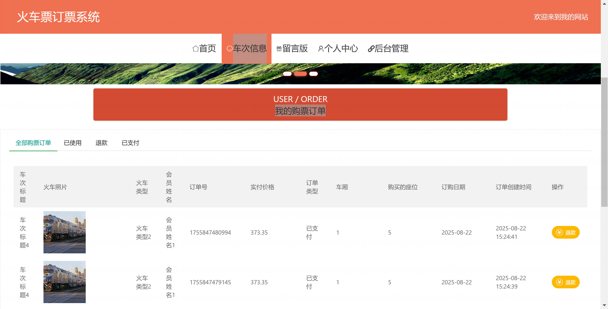

基于Springboot的火车票订票系统（程序+论文）
=

### 完整代码获取地址：从戎源码网 ([https://armycodes.com/](https://armycodes.com/))
### 作者微信：19941326836  QQ：952045282 
### 承接计算机毕业设计、Java毕业设计、Python毕业设计、深度学习、机器学习
### 选题+开题报告+任务书+程序定制+安装调试+论文+答辩ppt 一条龙服务
### 所有选题地址https://github.com/nature924/allProject

一、项目介绍
---

基于SpringBoot + Vue 的火车票订票系统，系统角色为管理员、会员（及游客），主要功能如下

管理员：
基本操作：登录、修改密码、获取个人信息、修改个人信息
车次管理：筛选车次、获取车次列表、查看车次详情、新增车次、修改车次、逻辑删除车次、车次上/下架
订单管理：筛选订单、获取订单列表、查看订单详情（包含级联车次与会员信息）、新增/保存订单、修改订单、删除订单、退款操作、发货/状态变更
会员管理：筛选会员信息、获取会员列表、查看会员详情、新增会员、修改会员、删除会员、调整会员余额
留言管理：获取留言列表、查看留言详情、新增留言、修改留言、删除留言

会员：
基本操作：注册、登录、修改密码、获取个人信息、修改个人信息
浏览与购票：查看车次列表、查看车次详情、下单购票（余额校验与扣款、生成订单号、设置订单状态与实付金额）、查看/管理个人订单、申请退款（通过退款接口）
留言：新增留言、查看留言列表与详情
文件与配置：查看前端展示配置（如轮播图）

游客：
基本操作：访问公开页面、注册、登录
查看功能：浏览车次列表（前端 list）、查看车次详情（前端 detail）、查看订单/留言列表（部分接口忽略鉴权用于展示）

二、项目技术
---
- 编程语言：Java
- 数据库：MySQL
- 项目管理工具：Maven
- 前端技术：VUE、HTML、Jquery、Bootstrap
- 后端技术：Spring、SpringMVC、MyBatis

三、运行环境
---
- 操作系统：Windows、macOS都可以
- JDK版本：JDK1.8以上都可以
- 开发工具：IDEA、Ecplise、Myecplise都可以
- 数据库: MySQL5.7以上都可以
- Tomcat：任意版本都可以
- Maven：任意版本都可以

四、运行截图
---
### 论文截图：

### 程序截图：

